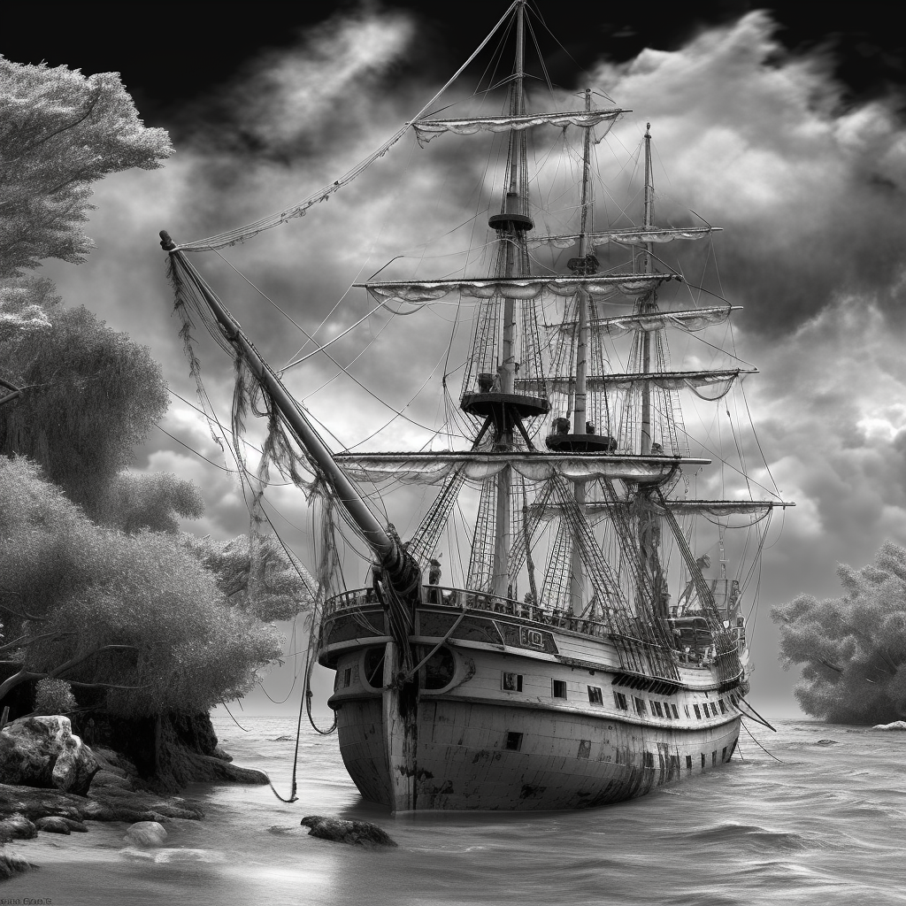

# Midjourney Python API (Unofficial)

Welcome aboard the unofficial Midjourney API 🎈🚀. A Python wrapper around the midjourney software to generate AI-based images.



## Setup & Installation

To get started, follow the steps below to run it on your machine:

1. Clone the repository:
    ```shell
    git clone https://github.com/yachty66/unofficial_midjourney_python_api.git
    ```
2. Install the required packages from `requirements.txt`.

3. If your folder structure resembles the one shown below and you wish to use the API in a file named `main.py`:
    ```shell
    project_directory
    │   main.py
    │
    └───unofficial_midjourney_python_api
        │   midjourney_api.py
    ```
   Then, you can import the API in `main.py` as follows:
    ```python 
    from unofficial_midjourney_python_api.midjourney_api import MidjourneyApi
    ```

4. If you haven't subscribed to midjourney yet, you should do so now.

5. With the same Discord account you used for your midjourney subscription, create a new server (name isn't crucial) and add the midjourney bot from midjourney to this server.

6. Next, you need to gather specific information to call the API appropriately - prompt, application_id, guild_id, channel_id, version, id, and authorization. 

7. Navigate to your discord server, open your developer console (on mac, you can use fn+f12), and open the network tab. 

8. Activate the midjourney bot with the slash command `/imagine` followed by an arbitrary prompt, then click on the `interactions` option.  

9. Firstly, visit the `Headers` tab and note down your `Authorization` key. Then, navigate to the `Payload` window and save the application_id, guild_id, channel_id, version, id, and authorization values from the JSON.

10. In your project root, create a new folder named `images`. Any image created by the API will be saved here.

11. Invoke the API as follows:
    ```python
    midjourney = MidjourneyApi(prompt="prompt", application_id="application_id", guild_id="guild_id", channel_id="channel_id", version="version", id="id", authorization="authorization")
    ```
Wait for about 1-2 minutes, and you should find your generated image within the `images` folder.

## Showcase of Projects Built with This API

- [CelebrityDiffusion](https://twitter.com/celebritydiff)

Have you created an exciting project using the API? DM me the details at [Twitter](https://twitter.com/MaxHager66)!

Happy journeying with Midjourney API!
